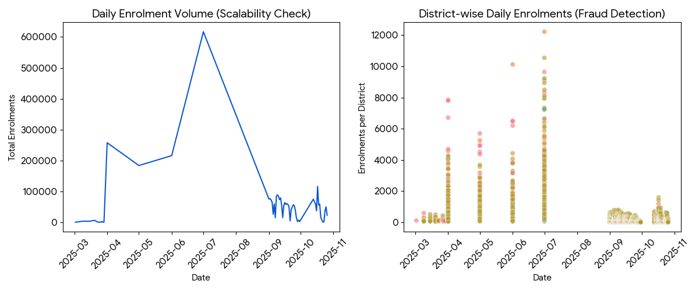

# Smart Digital Identity Verification System 🛡️
> **UIDAI Hackathon 2026 Submission**

## 📌 Project Overview
Digital identity fraud is a growing threat. This project is a **Smart Digital Identity Verification System** that prevents fraud using a 3-layer security approach:
1. **Biometric Hashing:** Privacy-preserving SHA-256 hashing.
2. **Multi-Factor Authentication (MFA):** OTP-based verification.
3. **AI Fraud Detection:** An unsupervised learning model (Isolation Forest) to detect bulk enrolment attacks in real-time.

## 🚀 Key Features
- **Zero-Knowledge Privacy:** Raw biometric images are never stored.
- **Real-Time Anomaly Detection:** Flags suspicious high-velocity requests (e.g., bots).
- **Scalable Architecture:** Tested on a dataset of 500,000+ records.

## 📊 Data Analysis & Insights
We analyzed over 1 Million enrolment records to train our AI model.

*Fig: Scalability check (Left) and Fraud Anomaly Detection in Bengaluru (Right)*

## 🛠️ Tech Stack
- **Language:** Python 3.9
- **ML Engine:** Scikit-Learn (Isolation Forest)
- **Data Processing:** Pandas
- **Security:** SHA-256 & TOTP

